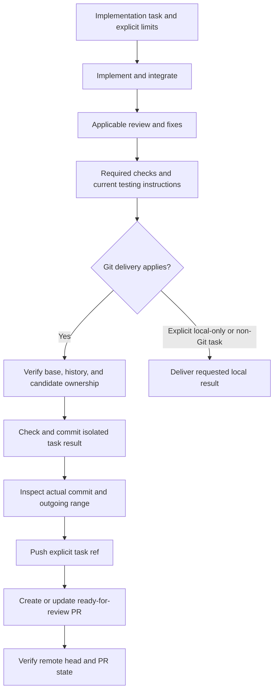

# Git delivery and definition of done

For implementation work in a Git repository, AgentKit's default deliverable includes a scoped commit, a push to the intended delivery remote, and a ready-for-review pull request. A request to implement a feature, fix, configuration change, repository asset, or documentation update using this workflow includes those delivery steps; do not stop after local edits or ask for separate confirmation of each ordinary Git step.

At task start, decide whether this default applies and carry the delivery steps into the task-specific plan. When a higher-priority instruction requires Git mutations to be named in an approved plan, explicitly include task-branch creation or reuse, the scoped commit, the source-to-destination push, and creation or update of the ready-for-review PR, then wait for the user to approve that task-specific plan. An earlier implementation request or request for those delivery steps does not satisfy the plan-approval gate. Once the user approves the task-specific plan, proceed without asking again. When no such gate applies, the default workflow or an explicit delivery request authorizes the ordinary Git delivery steps without an extra confirmation. If an approved plan covered only local edits or omitted Git delivery under a rule that requires it to be named, obtain that one missing approval before mutating repository state; do not silently drop the delivery stage or call the local result done.

Explicit task restrictions take precedence, including local-only work, no commit/push/PR, no remote mutations, and a request for a patch or proposal only. Review-only, research, architecture/planning-only, and release-readiness assessments keep their existing report-only scope. Non-Git artifact work does not require creating a repository or remote. This default does not authorize merging or approving a PR, deploying, publishing a release or external content, marking a tracker item Done, force-pushing, or discarding unrelated work.

## One delivery owner

The coordinator owns Git delivery after integrating the specialists' work, resolving required review findings, completing applicable checks, and finalizing the [testing handoff](testing-handoff.md). Delegated specialists return their scoped changes and evidence; they do not independently commit, push, or create PRs unless the coordinator explicitly assigns that ownership. A directly invoked specialist without a coordinator owns delivery for its task. A specialist's completion checkpoint is an intermediate handoff; it is not a claim that the whole implementation is delivered.

## Deliver the final change

1. **Establish the starting state and destination.** At task start, record the current branch and HEAD, the full index, and staged, unstaged, and untracked changes so existing work can be distinguished from task edits. Refresh that evidence before delivery. Inspect repository instructions, commit identity, intended remote and destination branch, and any existing task PR. Apply the [tooling and credential policies](tooling-and-credentials.md), repository conventions, and task restrictions. Reuse known authorization; do not change account configuration or retrieve new credentials merely because delivery is next. Use `origin` only when it is the intended destination, and establish the explicit source-to-destination ref mapping.
2. **Resolve the PR base before choosing a task branch.** Follow explicit task instructions and repository contribution conventions; preserve a suitable existing PR's base unless the task requires changing it. Use the repository default branch only when there is no evidence for another target. Release, development, and parent-task branches for stacked PRs can be valid bases. Verify the selected base ref and commit, then use a suitable existing task branch or create a `codex/` branch by default, following an explicit user or repository branch convention. Branch protection is separate from base selection. Do not push directly to the base, overwrite a conflicting branch, or create a remote repository without authorization.
3. **Audit history and isolate task ownership.** Inspect all commits in the proposed base-to-candidate range and the complete PR diff. When the destination branch exists, also inspect outgoing commits relative to its current verified head. A missing upstream or a new branch does not waive the base-to-candidate history review. Unrelated commits remain publishable even when reverted later; checking only the net diff or creating a new branch from the same HEAD does not isolate them. If history is unrelated, create an isolated checkout/worktree on a new task branch from the verified intended base and transfer only reviewed task changes. If history is suitable but the index contains unrelated work, isolate a checkout at the audited task tip instead, preserving existing task commits and the matching PR; a temporary local branch or detached worktree can hold the candidate for an explicit push to the verified task destination. Transfer only the reviewed task patch, not the source index. Preserve the original branch, files, and staged state; do not reset, stash, rewrite, or force-push unrelated work merely to obtain a clean checkout. Resolve ambiguous ownership before the dependent commit or push.
4. **Assemble and inspect the complete candidate.** Include the scoped implementation, tests, maintained regression inputs, golden files, snapshots, and test assets required by the change, even when the user did not name each fixture. Exclude credentials and disposable test environments, local runtime state, temporary reports, and generated scratch output. Stage only the reviewed task changes, then inspect the entire candidate index, including entries staged before this task. An ordinary commit is appropriate only when the whole index belongs to the task. A path-limited commit such as `git commit --only` takes working-tree contents for the named paths and is safe only when all changes in those paths belong to the task. For mixed staged/unstaged changes within one file, transfer a reviewed task-only patch at hunk level; do not stage or copy the whole file. Account explicitly for required untracked files, binary assets, deletions, and renames. If the changes cannot be separated reliably, preserve them and report the ambiguity rather than guessing.
5. **Check and commit the delivery candidate.** Run applicable final checks against the assembled result. When the original checkout contains extra changes or files that could affect those checks, run them in the isolated candidate checkout. Commit with a description of the resulting behavior, then inspect the actual commit contents and remaining index/working-tree state after hooks. A hook's modifications are new changes requiring review and affected checks. Validate tests that depend on delivered files from a fresh checkout of the committed result so an omitted local fixture cannot conceal a broken delivery. Refresh affected evidence when the result changes; do not bypass failing hooks or required checks.
6. **Recheck the range and push the explicit task ref.** Review the final commit range and PR diff against the verified base, and reconcile the current destination head immediately before pushing. Confirm the full outgoing history is within scope, including earlier commits and merge ancestry, and that the destination update preserves its existing history. If the base, destination, or candidate changed since inspection, refresh the affected comparison and checks before proceeding. Push only the verified task source ref to the intended destination ref without force, mirror, all-branch, or implicit tag pushes. If a push or remote check fails, inspect the actual result and changed remote state before retrying; do not overwrite a conflicting update or label failure as success.
7. **Verify the PR and preserved work.** Create a non-draft PR or update the existing PR for the same task branch and base. When an existing task PR is a draft and the required work is ready, mark it ready for review. Follow [diagram and pull-request guidance](diagrams-and-prs.md), including current testing instructions and expected results, actual validation, and material runtime or platform gaps. Verify the remote branch commit and the PR's URL, head, base, open state, and non-draft status. Verify that unrelated files and staged content in the original checkout remain intact. Report hosted checks according to their observed state; do not claim pending or unrun checks passed.

For history inspection, `git log <base>..<candidate>` shows commits reachable from the candidate but not the base; `git diff <base>...<candidate>` shows the usual PR change from their merge base. Use both, with refs resolved from the intended repository and task. For an existing destination, inspect `<destination-head>..<candidate>` as an additional outgoing range; it does not replace the PR-base comparison. Inspect complete commit patches as needed, not just commit subjects or file lists. Git command tests can validate these mechanics, but they do not prove that a fresh agent follows the procedure; record behavioral acceptance separately.

## Recovery and completion evidence

Before retrying after an interrupted commit, push, or PR request, inspect what succeeded. Preserve commit IDs, branch names, remote state, and PR URLs; resume only the remaining step after refreshing scope and destination checks. An existing remote head containing the intended commit is evidence that the push occurred, not proof that later commits are task-owned; inspect any additional history before treating that head as the delivered result. Reuse a matching task PR rather than creating a duplicate. Preserve isolated checkouts until their result and any remaining work are accounted for; remove only task-created disposable state after verifying its path and contents. A no-change task should not manufacture an empty commit or PR; report the existing state and whether any requested delivery remains.

For normal Git delivery, the final response includes the commit ID, pushed branch, PR link and ready-for-review status, actual checks, testing instructions or their link, and material unresolved limits. Only report delivery complete once these outcomes are verified and no required implementation/review work remains. A ready-for-review PR is the delivery endpoint; it does not mean merged, deployed, released, approved, or externally marked Done.

When the user restricts delivery, report what completed under that restriction. If Git delivery applies but credentials, access, an unclear destination, a failed operation, or a service outage blocks it, finish the independent authorized work and report the completed steps, concrete blocker, and next action. Preserve the result as partial delivery; do not silently redefine Done as local edits. Runtime or platform checks that cannot be performed remain explicit acceptance gaps and do not become passed checks through PR creation.
