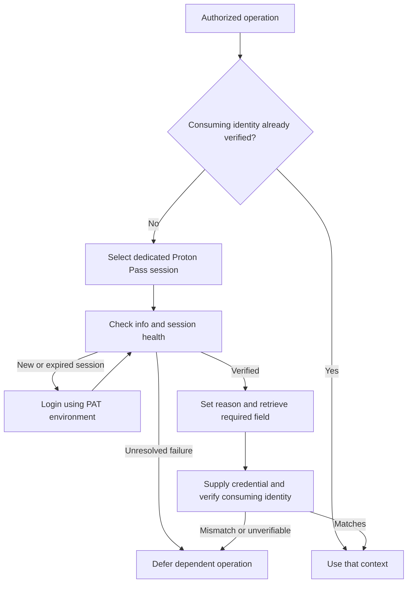

# Proton Pass CLI for agents

Use this reference when the user or selected credential policy specifies Proton Pass (ProtonPass) and Proton Pass CLI (`pass-cli`) for an authorized operation. Apply [tooling and credential policies](tooling-and-credentials.md) first. Reuse and verify an already-correct consuming-tool session before retrieving credentials. Reading this reference or editing a policy does not require logging in or enumerating vaults.

This adapts Proton's agent instructions into reusable guidance. Keep personal access tokens (PATs), retrieved values, and session files out of skills, policies, memory, repository files, command arguments, logs, and reports. The PAT is supplied through `PROTON_PASS_PERSONAL_ACCESS_TOKEN`; it is distinct from the service credential stored in an item. Preserve access to the user's protected PAT source for later login processes without copying its value into documentation or persisting it elsewhere.



## Prepare the CLI and a dedicated session

Before using Proton Pass, use the protected `PROTON_PASS_PERSONAL_ACCESS_TOKEN` environment variable supplied by the user's existing local setup when a dedicated session needs login. This bootstrap PAT is not stored in Proton Pass and must never be represented as a policy item or `pass://` reference; doing so would create a circular dependency. The policy's `Expected identity` remains the downstream GitHub, Plane, or infrastructure account. A token/agent name is optional metadata: compare the name reported by `pass-cli info` only when the user explicitly supplied an expected nonsecret name. Never infer a required name from the current session or the service account.

1. Run `pass-cli --version`. If the executable is unavailable, check its installed location and PATH before following Proton's [platform installation instructions](https://protonpass.github.io/pass-cli/get-started/installation/) within the task's setup scope. AgentKit's installer does not install the CLI.
2. Before any session inspection, login, or logout, select a directory dedicated to this task and worker. Reuse a directory only when its ownership and purpose are established. Never log out the user's default session to prepare an agent session.
3. Run `pass-cli info` in that context. If successful, verify that the dedicated session is healthy; a PAT session may report a token name rather than a user email. If an expected token name was explicitly supplied, compare it, but do not require one that is absent from policy or setup instructions. Do not treat an unrelated personal session as the requested dedicated session. If the directory is new and has no session, proceed to the PAT login below. Diagnose other failures before changing authentication state.
4. For required login, confirm `PROTON_PASS_PERSONAL_ACCESS_TOKEN` is present without printing its value, then run `pass-cli login`. Check its exit code and run `pass-cli info` again to verify the dedicated session. If the PAT is unavailable or rejected, defer the dependent credential operation; do not silently switch to interactive account login or create another token.

In a dedicated PowerShell process, create the session path once and retain it for subsequent commands:

```powershell
$env:PROTON_PASS_SESSION_DIR = Join-Path ([IO.Path]::GetTempPath()) ('pass-agent-' + [guid]::NewGuid().ToString('N'))
```

On Linux/macOS, the corresponding shell syntax is:

```sh
export PROTON_PASS_SESSION_DIR="$(mktemp -d "${TMPDIR:-/tmp}/pass-agent-XXXXXXXX")"
```

Use a private OS temporary location for authentication state even when ordinary project scratch files belong in `.work`. Do not share this directory between concurrent workers. Process environment changes may not survive separate shell-tool calls: explicitly restore the same non-secret session path in each later process, and supply the PAT only to processes that need login. Keep unrelated child processes from inheriting the PAT.

## Check health and recover deliberately

Before each authenticated command, run `pass-cli info`, check its exit code, and confirm the dedicated session is healthy. If an expected token name was explicitly supplied, compare it as part of that check. This preflight does not recursively apply to `info`, local version/help commands, or the login/logout commands needed to restore a failed session. Recheck after interruptions and during long tasks; Proton documents PAT sessions as lasting two hours in its [login reference](https://protonpass.github.io/pass-cli/commands/login/#personal-access-token-login).

On failure, inspect the full diagnostic and exit code through a channel that does not expose secrets. An authentication error can require recovery; permission denial, a missing item, bad arguments, and connection failures require their own diagnosis. A nonzero exit code alone is not a reason to log out. Use `pass-cli test` after a successful preflight when a connection-health check is needed.

For a confirmed stale or expired session, verify the dedicated session path, run `pass-cli logout`, and use `pass-cli logout --force` only if normal logout cannot clear it. Then log in using the supplied PAT environment variable and verify with `pass-cli info`. Retry a failed read once after successful recovery. If recovery or the retry fails, report the specific limitation instead of looping. Before retrying any mutation or a consumer launched by `run`, establish whether it already completed; an ambiguous outcome is not permission to repeat it.

## Discover only the needed resources

For an authorized access check, run the following separately, each after a successful session preflight:

```text
pass-cli vault list --output json
pass-cli share list --output json
```

Confirm the intended vault or directly shared item is accessible. A directly shared item may appear in the share list without a vault grant; do not request broader access merely to populate the vault list. If the user explicitly expects a vault, report its absence. Return the requested non-secret listing or relevant access result to the user, while keeping private metadata out of public artifacts.

For item discovery, prefer `pass-cli item list --vault-name "replace-with-vault-name" --output json`. Use an unscoped `pass-cli item list --output json` only when broader discovery is needed and authorized; inspect the installed CLI's help and defaults before assuming which items it lists. Prefer known share/item IDs to ambiguous names, and never select the first duplicate title. Use JSON when parsing programmatically.

## State the reason for access

Set `PROTON_PASS_AGENT_REASON` in the command's process to a specific description of the authorized task, target, and reason for accessing the item or field. Keep it non-empty, at most 300 characters, and free of secret values. Update it when the purpose changes.

```powershell
$env:PROTON_PASS_AGENT_REASON = 'Verify the automation account for the requested repository operation.'
```

Proton's [agent command reference](https://protonpass.github.io/pass-cli/commands/agent/) requires this reason for `item view`, every `item create` variant, `item update`, `item trash`, `item untrash`, `item move`, and `vault update`. Set a reason for credential access through `run` as well. A reason records purpose; it does not authorize writes, item movement, access grants, or token administration.

## Retrieve and supply a credential

Policy references contain identifiers, such as `pass://replace-with-share-id/replace-with-item-id/replace-with-field`, or an explicit vault name, item title, and field. Confirm the destination and consuming command before access. An `item view` field read prints the credential to stdout, so do not run it as a standalone terminal-tool command. Use the protected `run` workflow below for consumers that accept environment credentials. For another consumer, establish a supported direct credential-transfer channel before reading anything; do not retrieve a secret into model-visible output while figuring out how to supply it.

Prefer [pass-cli run](https://protonpass.github.io/pass-cli/commands/contents/run/) when the consuming tool supports environment credentials. It resolves `pass://` references in environment variables and passes the values to its child process. Keep its default masking enabled. Use a dedicated environment containing only the authorized references: `run` also scans inherited variables, so an env file alone does not isolate unrelated references. Inspect the consumer's relevant behavior and output first; masking does not make an environment dump or a credential-logging command appropriate.

For example, after verifying the dedicated Proton session and setting the access reason, use this PowerShell 7 example on Windows when GitHub CLI is the approved consumer. It starts `pass-cli run` with an explicitly cleared child environment, adds only reviewed platform paths, session metadata, and the single intended item reference, and addresses both executables by their resolved paths. The login PAT and unrelated inherited `pass://` references are excluded even if they remain in the parent login process. Review the selected executables and replace the item reference before use; never copy the whole parent environment to make a missing setting work.

```powershell
$passPath = (Get-Command pass-cli -CommandType Application -ErrorAction Stop).Source
$consumerPath = (Get-Command gh -CommandType Application -ErrorAction Stop).Source
if (-not $env:PROTON_PASS_SESSION_DIR -or -not $env:PROTON_PASS_AGENT_REASON) {
    throw 'Verify the dedicated session and set the access reason first.'
}
$startInfo = [Diagnostics.ProcessStartInfo]::new($passPath)
$startInfo.UseShellExecute = $false
$startInfo.CreateNoWindow = $true
$startInfo.Environment.Clear()
foreach ($name in @('SystemRoot', 'WINDIR', 'USERPROFILE', 'APPDATA', 'LOCALAPPDATA', 'TEMP', 'TMP', 'PROTON_PASS_SESSION_DIR', 'PROTON_PASS_AGENT_REASON')) {
    $value = [Environment]::GetEnvironmentVariable($name, 'Process')
    if ($value) {
        if ($value -match 'pass://') { throw 'Unexpected secret reference in a platform path or session metadata.' }
        $startInfo.Environment[$name] = $value
    }
}
$startInfo.Environment['GH_TOKEN'] = 'pass://replace-with-share-id/replace-with-item-id/replace-with-field'
foreach ($argument in @('run', '--', $consumerPath, 'api', 'user', '--jq', '.login')) {
    $startInfo.ArgumentList.Add($argument)
}
$process = [Diagnostics.Process]::Start($startInfo)
try {
    $process.WaitForExit()
    if ($process.ExitCode -ne 0) { throw 'GitHub identity verification failed; inspect the sanitized diagnostic.' }
} finally {
    $process.Dispose()
}
```

This example uses the existing verified session and does not perform login. If reauthentication is needed, do it separately in the dedicated login context, verify `info`, then rebuild this cleared child environment. For other platforms or consumers, use the same explicit environment allowlist and supported platform paths; add proxy or other settings only when needed, reviewed, and free of unrelated credentials or item references. The environment boundary limits inheritance; it does not sandbox a consumer from other files or processes accessible to the same user.

Compare the returned login with the policy's expected GitHub account, then use the same verified credential context for the authorized operation. Other tools require their own supported credential channel and identity check. A successful Proton Pass login proves access to the credential manager, not the identity of GitHub, Plane, a cloud provider, a connector, or a separate Git transport. Reading an item does not reauthenticate an existing connector. If the available tool cannot transfer credentials without exposing them or cannot verify the intended identity, defer only that operation.

## Cleanup and maintenance

After the task's dedicated session is no longer needed, log out of that session and remove task-scoped credential and reason variables or end the dedicated process. Remove only the task-created session directory after resolving its absolute path and confirming ownership; do not delete another task's session or the user's default session. Retain only non-secret recovery context when work is intentionally paused.

Consult the installed CLI's help and Proton's [CLI documentation](https://protonpass.github.io/pass-cli/) when behavior differs. `pass-cli agent instructions` provides current agent guidance, but inspect or redact its output before exposing or saving it because generated instructions can include a supplied token. Preserve the applicable authorization and output-handling rules when adapting upstream examples.
