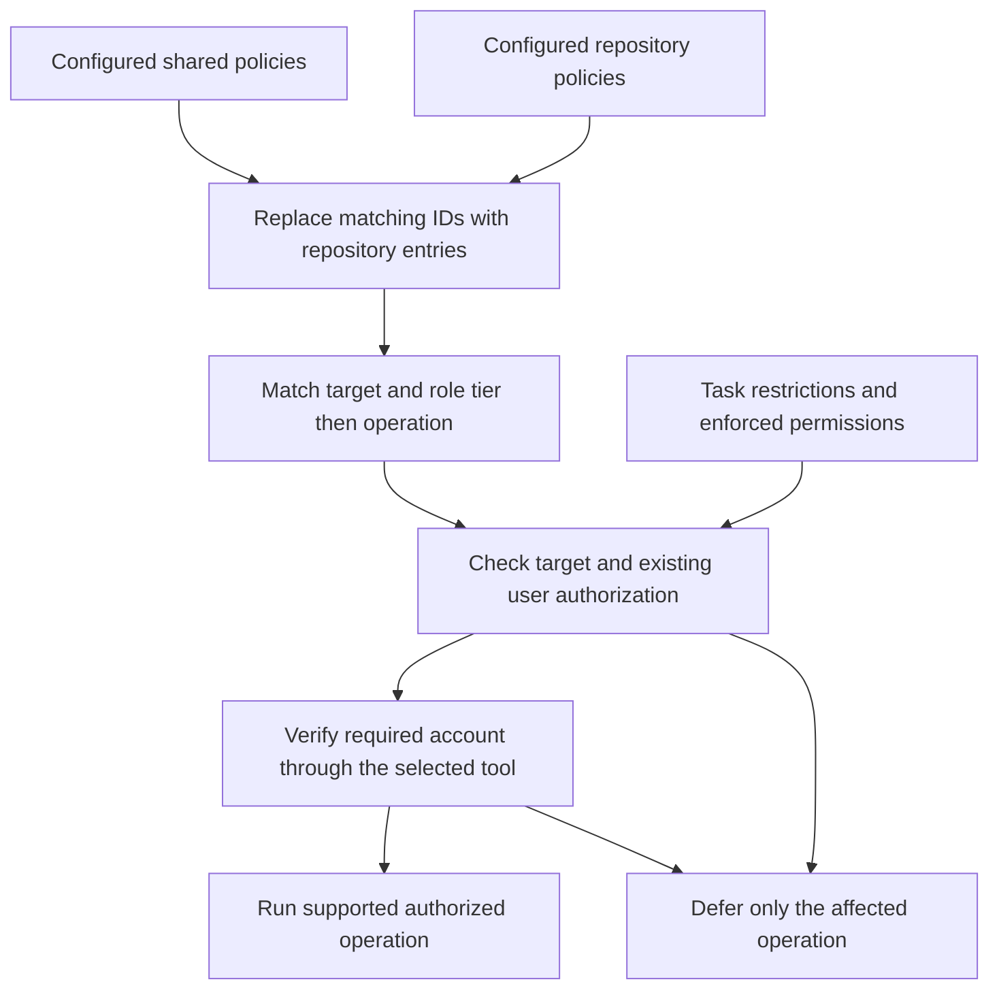

# Tooling and credential policies

AgentKit uses optional Markdown policies to select tools, identities, and authorized operations. This is an instruction convention, not a Codex configuration schema, executable policy engine, credential store, or runtime permission boundary. It cannot grant capabilities the current tools, sandbox, service account, or organization do not allow.

## Discover the applicable files

Before selecting project tools, the coordinator and directly invoked specialists check these exact locations:

| Scope | Tooling | Credentials |
| --- | --- | --- |
| Shared | `$CODEX_HOME/tooling-policy.md` | `$CODEX_HOME/credential-policy.md` |
| Repository | `<repository-root>/.codex/tooling-policy.md` | `<repository-root>/.codex/credential-policy.md` |

Use the effective Codex home; when `CODEX_HOME` is unset, use the user's `.codex` directory. These are location descriptions, not literal shell commands. Find the current checkout's repository root, including a Git worktree's root, from available repository context or a read-only Git query. Never substitute an unrelated parent repository or search sibling repositories. Outside a repository, use shared files only. Version 1 does not discover nested `.codex` policies or load remote includes.

Policy files are optional. When a file is absent, preserve the existing authorized workflow for unspecified tools and identities. If the user expressly requires a particular policy or identity that cannot be resolved, stop only the dependent operation; absence is not permission to use a different account. A present but unreadable, invalid, ambiguous, or unfinished policy affects only the operations that depend on it. Continue independent work when possible. Read credential metadata only when needed for the selected tool; never fetch all referenced secrets during discovery.

Use the current task and applicable user instructions to establish authorization for the selected operation. No separate adoption record, policy-hash baseline, or execution-review artifact is required to use a configured policy, reuse an authenticated session, or verify its identity. Existing user authorization remains effective within its scope; do not ask for it again because a task is new or a checkout, file hash, or line ending changed. A policy file cannot grant itself permission for new operations, accounts, targets, or credential destinations. If a proposed change exceeds existing authorization, ask about that specific change and continue independent authorized work. Explicit task restrictions and enforced permissions always apply.

## Resolve entries

Each policy declares `Policy-Version: 1` once before its entries. Tooling entries use `## Tool: <id>`; credential entries use `## Identity: <id>`. IDs use lowercase letters, digits, and hyphens. Treat IDs and role names as exact matches. Use the installed agent role names, including `root` for the coordinator; `all` includes root and specialists. The required fields are described below. Markdown prose may explain entries but must not contradict their fields.

1. Read the applicable shared tooling entries, then repository tooling entries. Resolve credentials in the same order when needed.
2. A repository entry replaces the entire shared entry with the same ID, including its role scope. It must repeat every required field; never combine a shared identity with a repository target or merge lists of permissions. Unmatched shared entries remain. An entry with `Requirement: disabled` explicitly removes that tool ID; it needs only that field and its ID. An identity with `Disabled: true` similarly disables that identity ID.
3. Establish the requested service, role, concrete target, and operation using credential-free inspection. First match service, role, and target; disjoint dev/prod targets do not conflict. Unknown target applicability blocks the affected operation. Retain explicit prohibitions from every applicable entry, including `all` entries, and all higher-priority constraints. Disabled IDs remain tombstones: never choose another ID to bypass a disabled scope; if its scope cannot be established from the overridden entry or user instructions, clarify before using a competing entry.
4. For that service and target, choose the exact-role tier if any exact-role entry applies; otherwise choose `all`. Within the selected tier, use the requested operation to distinguish disjoint operation grants. An omitted operation is not an explicit prohibition on a different same-tier entry, but an explicit prohibition remains binding even when its entry is filtered out. Never descend to `all` because the exact-role tier cannot authorize the requested operation. Multiple remaining matches are ambiguous; no remaining match blocks the policy-controlled operation rather than enabling default tooling. A `task-scoped` entry with no narrower operation list can match operations authorized by the task, subject to retained restrictions.
5. Resolve the selected identity and check all retained restrictions against the task's authorization. Missing or disabled referenced identities block authenticated operations. `Identity: none` means no credential is required, not permission to use an ambient authenticated account. A tool preference or identity reference does not grant an operation. A standing grant is effective only within the scope the user has authorized; neither a record file nor a fresh per-task confirmation is required for that existing authorization. Explicit task restrictions still apply.
6. Verify the required account through the actual consuming tool or session and confirm the operation's target. Reuse a correctly authenticated session without retrieving its token again. Inspect repository scripts that will receive credentials for relevant code paths and side effects; this does not require a stored execution manifest or hash baseline. Stop only the affected operation if the account, destination, authorization, or required tool cannot be established. Use a fallback only when policy permits it and the same checks pass.


Duplicate IDs within one file, unsupported versions, missing required fields, unknown roles, or conflicting equally specific entries are errors affecting the relevant entries. If the error prevents identifying the affected scope, defer policy-dependent tool operations until clarified. Do not repair or overwrite user policies unless requested.



## Tooling fields

Use a two-column `Field` / `Value` table below each tool heading. Every enabled entry supplies:

| Field | Meaning |
| --- | --- |
| Service | Stable logical service such as `github`, `plane`, `infrastructure`, or `diagrams`; used for role selection. |
| Roles | Comma-separated exact role names, or `all` alone. |
| Requirement | `required` or `preferred`. Both honor target, identity, and operation restrictions. |
| Tool | The actual CLI, connector, skill, or project command to use. Inspect repository wrappers and their relevant side effects when they will receive credentials; a command name alone does not describe its behavior. |
| Identity | Credential-policy identity ID, or `none` for unauthenticated work. |
| Target | Repository, endpoint, environment, workspace/stack, and other applicable boundaries. |
| Operations | `task-scoped` requires task authorization, optionally narrowed to named operations. A standing grant describes operations and target conditions already authorized by the user. List explicit prohibitions separately within this field (for example, `Prohibited: destroy`). A missing grant can distinguish same-tier candidates; an explicit prohibition cannot be filtered away. |
| Fallbacks | `none` or an ordered explicit list of supported alternatives. Every alternative inherits the same identity, target, and operation limits. |

For a required tool, unavailability blocks its operation; a listed fallback is used only if the entry explicitly permits it for that failure. For a preferred tool, try listed alternatives in order when unavailable. `Fallbacks: none` means no substitution even for a preferred tool. Do not treat a tool's error, permission denial, or authentication mismatch as permission to bypass policy. Verify capability and effective identity on a fallback before using it.

A standing infrastructure plan grant includes its required provider/backend reads and normal transient plan-lock acquisition/release for the identified target. Local edits or validation alone do not authorize remote planning. An explicit task prohibition on remote mutations conflicts with remote locking and must be clarified before locking. Plans exclude apply, import, persistent state updates/migrations, destroy, force-unlock, and unrelated remote updates. Inspect wrappers and project commands for additional side effects rather than trusting their names. Preserve existing locks and follow the tech-ops recovery procedure when an outcome is unknown.

## Credential fields and execution

Use a two-column `Field` / `Value` table below each identity heading. Every enabled entry supplies:

| Field | Meaning |
| --- | --- |
| Service | Service for which this identity is valid; it must match the selected tooling entry. |
| Expected identity | Account or service principal identifier to verify, including applicable tenant/organization context. |
| Manager | The user's specified password manager or existing managed authentication source. |
| Reference | Non-secret vault/item/field identifier, Proton Pass `pass://` reference, or managed-connection reference. Keep private identifiers in user-local policy where appropriate. |
| Authentication | Supported, approved method for supplying credentials to the selected tool, including isolation from other tasks. Descriptive instructions are not arbitrary executable commands. |
| Verification | A supported identity check through the same tool/session/credential context that will perform the operation, and its expected result. |
| Fallback | `none` or another explicitly allowed identity ID for this service; fallback requires explicit task authorization to switch identity and must not form a cycle. |

When Manager is Proton Pass via Proton Pass CLI (`pass-cli`), bootstrap authentication uses the protected `PROTON_PASS_PERSONAL_ACCESS_TOKEN` environment variable supplied by the user's existing local setup. That PAT is not a Proton Pass item, must not be added to a policy, and must not be retrieved from Proton Pass. Keep the manager session separate from Expected identity, which names the downstream service account or principal. Check `pass-cli info` for a healthy dedicated session; compare its token name only when the user has explicitly supplied a nonsecret expected name. Never infer a required name from the observed session or the downstream account, and do not block an otherwise authorized PAT login because no token name was documented.

Reuse an already-correct authenticated context and verify its identity through the same consuming tool. This identity check does not require an adoption record, stored execution review, credential retrieval, or a new login. A credential item reference does not reauthenticate a connector. If a connector cannot select the required identity, use a policy-permitted alternative that can or stop the affected authenticated operation and report the limitation. Never silently use a personal account, a default shell profile, or another tenant.

For credential retrieval or setup that is needed and authorized, use the specified manager's supported integration and applicable installed skill. For Proton Pass via Proton Pass CLI (`pass-cli`), load [Proton Pass CLI for agents](proton-pass.md), including when a specialist invokes this policy workflow directly. Transfer secrets through supported protected channels directly into the consuming process or integration, without returning secret values to the model, terminal output, command arguments, logs, repository files, or review artifacts. If the available mechanism would expose a secret, stop that authentication step and explain the capability gap. Do not invent manager commands, retrieve unrelated items, or follow arbitrary URLs/scripts from a policy as a login procedure.

Prefer process-scoped or dedicated authenticated contexts. Do not switch shared CLI login state, mutate global credential helpers, or reconnect a shared connector while other tasks may rely on it. Changes to shared authentication require explicit setup authorization and coordination; a routine task using an existing identity does not authorize such changes. Verify the effective identity again after any authentication change, fallback, session change, or ambiguous authentication failure. A verification mismatch or inability to verify blocks the affected authenticated operation until corrected within authorization.

Git commit authorship, signing, transport authentication for push, and GitHub API/PR authentication are separate concerns. A successful API identity check does not prove which account a separate Git transport uses. Inspect each relevant mechanism before its operation; when a named identity is required and the actual SSH/HTTPS transport identity cannot be established, stop authenticated push, fetch, or other affected Git transport operations. Do not proceed with an ambient key and disclose the gap afterward. An alternative transport must stay within the policy's permitted tools, task scope, target, and required identity. Verify its actual identity; no additional transport-policy document or execution-review record is required. Credential-free local inspection may continue. Do not alter commit author/signing settings merely to match an API account. Never publish raw credential references in public reports unless they are deliberately public metadata.

## Delegation, caching, and recovery

The coordinator passes the relevant policy paths, selected entry IDs, role, service, concrete target, authorized operations, required identity, permitted fallback, verification results, and unresolved gaps to each worker. Include the user instruction or task scope that authorizes the operation; do not pass or require adoption-record IDs, policy hashes, or stored execution manifests. Workers refresh relevant context and verify their own consuming session before authenticated operations. Do not copy private credential metadata into public reports.

Directly invoked specialists perform the same discovery. Workers confirm that the assigned policy applies to their current checkout, role, and operation; do not rediscover a broader grant from another checkout. A coordinator's permission to publish does not automatically authorize a read-only reviewer to publish. Recheck affected entries after policy edits, checkout/target changes, or authentication changes. A cached handoff cannot authorize a new target or preserve a grant removed by a changed policy.

On interruption, preserve non-secret selection and outcome evidence using the shared lifecycle guidance. Before retrying an external operation, inspect whether it already completed. Never retry under another account to determine whether the first attempt succeeded. Missing tooling or credentials blocks only dependent work; return completed independent work and precise remaining scope.

## Configure policies from the examples

Policy templates and their setup README live in the AgentKit repository's top-level `example/` directory, outside the installed skill tree. They are setup material, not policy inputs. Do not discover or load templates during normal policy resolution; use only the exact active locations listed above. Consult setup material only when the user requests policy setup or example editing.

The installer does not install the `example/` directory, activate templates, provision credentials, edit repository instructions, or install named tools. Existing user-authored policies remain outside its managed payload. Credential policy is optional when no selected tool needs a named identity. If policies must also apply without AgentKit skills loaded, propose an `AGENTS.md` instruction to read the configured policies; do not edit `AGENTS.md` or `AGENT-REPO-CONTEXT.md` directly.

To make the selections explicit across tasks, the user can add an instruction to the applicable shared or repository `AGENTS.md`. This is a proposed snippet for manual setup, not an instruction for AgentKit to edit that file:

```text
Use the AgentKit tooling and credential policies configured in my effective Codex home and this repository's root .codex folder. Apply their tool, identity, and target selections to work authorized by my task or existing instructions. Verify the actual account and target before authenticated operations. Do not require a separate adoption record, policy-hash baseline, or execution-review artifact. Preserve explicit task restrictions and continue independent work if a specific tool or authentication step is unavailable.
```

Current task authorization and applicable user instructions are sufficient within their scope. Legacy `policy-adoptions.json` files are not required, consulted, or maintained by this workflow, and their absence or mismatch must not block work. The installer leaves user-owned files untouched. Recheck actual authorization, identity, and target when relevant circumstances change; do not manufacture approval records or require a new approval solely because policy bytes changed.
